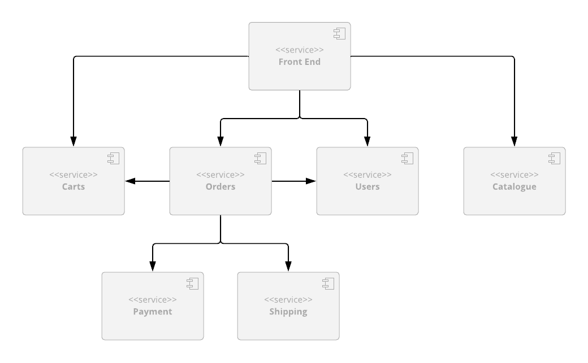

# Coherence Helidon Sock Shop 

This project is an implementation of a stateful, microservices based application that
uses [Oracle Coherence CE](https://coherence.community/) as a scalable embedded data
store, and [Helidon MP](https://helidon.io/) as application framework.

The application is an online store that sells socks, and is based
on the [SockShop Microservices Demo](https://microservices-demo.github.io)
originally written and published under Apache 2.0 license by [Weaveworks](https://go.weave.works/socks).

You can see a working demo of the original application [here](http://socks.weave.works/).

This demo still uses the original front end implementation provided by Weaveworks,
but all back end services have been re-implemented from scratch using Helidon MP 
and Oracle Coherence, in order to showcase Coherence integration with Helidon, and
Eclipse MicroProfile in general.

We also provide the implementations of the same application that use Spring Boot or Micronaut 
as the application framework, in case one of those is your framework of choice.

* [Coherence Spring Sock Shop](https://github.com/oracle/coherence-spring-sockshop-sample)
* [Coherence Micronaut Sock Shop](https://github.com/oracle/coherence-micronaut-sockshop-sample)

# Table of Contents

- [Coherence Helidon Sock Shop](#coherence-helidon-sock-shop)
- [Table of Contents](#table-of-contents)
  - [Architecture](#architecture)
  - [Project Structure](#project-structure)
  - [Pre-Requisites](#pre-requisites)
  - [How to Run](#how-to-run)
    - [Option 1: Using Helm (Recommended)](#option-1-using-helm-recommended)
      - [Install the Coherence Operator](#install-the-coherence-operator)
      - [Deploy Sock Shop](#deploy-sock-shop)
      - [Customization Examples](#customization-examples)
      - [Uninstall](#uninstall)
    - [Option 2: Using Kustomize](#option-2-using-kustomize)
      - [Install the Coherence Operator](#install-the-coherence-operator-1)
      - [Installing Backend Services](#installing-backend-services)
      - [Install Frontend](#install-frontend)
      - [Install Load Generator (Optional)](#install-load-generator-optional)
      - [Access the Application](#access-the-application)
      - [Check Pod Status](#check-pod-status)
      - [Cleanup](#cleanup)
    - [Scale Back-End](#scale-back-end)
  - [Complete Application Deployment](#complete-application-deployment)
  - [Load Testing](#load-testing)
  - [Development](#development)
  - [Version Management](#version-management)
  - [Contributing](#contributing)
  - [Security](#security)
  - [License](#license)


## Architecture

The application consists of 6 back end services (rewritten from the ground up on top of
Helidon, implementing the API that the legacy `front-end` service expects).



- **[Product Catalog](./catalog)**, which provides 
REST API that allows you to search product catalog and retrieve individual product details;

- **[Shopping Cart](./carts)**, which provides 
REST API that allows you to manage customers' shopping carts;

- **[Orders](./orders)**, which provides REST API 
that allows customers to place orders;

- **[Payment](./payment)**, which provides REST API 
that allows you to process payments;

- **[Shipping](./shipping)**, which provides REST API 
that allows you to ship orders and track shipments;

- **[Users](./users)**, which provides REST API 
that allows you to manage customer information and provides registration and 
authentication functionality for the customers.

You can find more details for each service within documentation pages for individual
services, which can be accessed using the links above.

## Project Structure

Each back end service described above has its own GitHub repo, so it can be versioned
and released independently of other services. 

In addition to that, there is also a main 
[Sock Shop](.) repository (the one you are 
currently in), which contains Kubernetes deployment files for the whole application, 
top-level POM file which allows you to easily build the whole project and import it 
into your favorite IDE, and a _bash_ script that makes it easy to check out and update 
all project repositories at once.

## Pre-Requisites

1. Latest version of `kubectl` available from https://kubernetes.io/docs/tasks/tools/.
2. Helm 3.0+ (for Helm installation method)
3. Docker or Rancher
4. A remote or local Kubernetes cluster - Min 1.16+
5. Maven 3.8+ and JDK 17 (for development)
kubectl exec <orders-pod> -- env | grep JAVA_TOOL_OPTIONS
kubectl exec <carts-pod> -- env | grep JAVA_TOOL_OPTIONS
## How to Run

There are two ways to deploy the Sock Shop application: using Helm (recommended) or using Kustomize.

### Option 1: Using Helm (Recommended)

The Helm chart provides a unified deployment that includes backend services, frontend, and load generator in a single command.

#### Install the Coherence Operator

Install the Coherence Operator using the instructions in the [Coherence Operator Quick Start](https://oracle.github.io/coherence-operator/docs/latest/#/docs/about/03_quickstart) documentation.

Quick installation:
```bash
kubectl apply -f https://github.com/oracle/coherence-operator/releases/download/v3.3.4/coherence-operator.yaml
```

#### Deploy Sock Shop

1. Create a namespace:
```bash
kubectl create namespace sockshop
```

2. Install the complete application (backend, frontend, and load generator):
```bash
helm install sockshop ./helm/sockshop -n sockshop
```

3. Check the deployment status:
```bash
kubectl get pods -n sockshop
helm status sockshop -n sockshop
```

4. Access the application:
```bash
kubectl port-forward --namespace sockshop service/front-end 8079:80
```

Open http://localhost:8079 in your browser.

#### Customization Examples

Deploy without load generator:
```bash
helm install sockshop ./helm/sockshop -n sockshop --set loadgen.enabled=false
```

Deploy with scaled backend services:
```bash
helm install sockshop ./helm/sockshop -n sockshop \
  --set carts.replicas=3 \
  --set catalog.replicas=3 \
  --set orders.replicas=3
```

Use custom image registry:
```bash
helm install sockshop ./helm/sockshop -n sockshop \
  --set global.imageRegistry=my-registry.com
```

For more configuration options, see the [Helm Chart Documentation](./helm/README.md).

#### Uninstall

```bash
helm uninstall sockshop --namespace sockshop
```

### Option 2: Using Kustomize

Kubernetes scripts depend on Kustomize, so make sure that you have a newer 
version of `kubectl` that supports it (at least 1.16 or above).

#### Install the Coherence Operator

Install the Coherence Operator using the instructions in the [Coherence Operator Quick Start](https://oracle.github.io/coherence-operator/docs/latest/#/docs/about/03_quickstart) documentation.

#### Installing Backend Services

Create a namespace in Kubernetes called `sockshop`:

```bash
kubectl create namespace sockshop
```

Install the backend services into the `sockshop` namespace:

```bash
kubectl apply -k k8s/coherence --namespace sockshop
```

#### Install Frontend

Install the frontend service:

```bash
kubectl apply -f k8s/optional/original-front-end.yaml --namespace sockshop
```

#### Install Load Generator (Optional)

Install the load generator for performance testing:

```bash
kubectl apply -f loadgen/k8s-deployment.yaml --namespace sockshop
```

#### Access the Application

Port-forward to the `front-end` UI:

```bash
kubectl port-forward --namespace sockshop service/front-end 8079:80
```

> Note: If you have installed into a namespace then add the `--namespace` option to all `kubectl` commands in these instructions.

You should be able to access the home page for the application by pointing your browser to http://localhost:8079/.

You should then be able to browse product catalog, add products to shopping cart, register as a new user, place an order,
browse order history, etc.

#### Check Pod Status

```bash
kubectl --namespace sockshop get pods
```

#### Cleanup

Once you are finished, you can clean up the environment by executing the following:

```bash
kubectl delete -f loadgen/k8s-deployment.yaml --namespace sockshop
kubectl delete -f k8s/optional/original-front-end.yaml --namespace sockshop
kubectl delete -k k8s/coherence --namespace sockshop
```

### Scale Back-End

If you wish to scale the back-end you can issue the following command

Scale only the orders microservice
```bash
kubectl --namespace sockshop scale coherence/orders --replicas=3
```

Or alternatively scale all the microservices
```bash
for name in carts catalog orders payment shipping users
    do kubectl --namespace sockshop scale coherence/$name --replicas=3
done
```

## Complete Application Deployment

The [How to Run](#how-to-run) above shows how you can run the application locally, but that may not
be enough if you want to experiment by scaling individual services, look at tracing data in Jaeger,
monitor services via Prometheus and Grafana, or make API calls directly via Swagger UI.

To do all of the above, you need to deploy the services into a managed Kubernetes cluster
in the cloud, by following the same set of steps described above (except for port forwarding,
which is not necessary), and performing a few additional steps.

 [Go to Complete Application Deployment section](./doc/complete-application-deployment.md)

## Load Testing

A comprehensive load generator is available to test the application under realistic conditions.
The load generator simulates actual e-commerce user behavior with configurable load patterns.

Features:
- Realistic user scenarios (browsing, cart operations, order placement)
- Multiple predefined load scenarios (light, medium, heavy, spike)
- Configuration-driven with YAML files
- Web UI for interactive testing
- Docker and Kubernetes deployment support
- Detailed metrics and reporting

 [Go to Load Generator Documentation](./loadgen/README.md) | [Quick Start Guide](./loadgen/QUICKSTART.md)

## Development

If you want to modify the demo, you will need to check out the code for the project, build it
locally, and (optionally) push new container images to the repository of your choice.

 [Go to Development section](./doc/development.md)

## Version Management

This project uses a centralized version management system to make version updates easier and less error-prone. All service versions are controlled from a single location using Maven properties and Helm global values.

**Key Features:**
- Single `sockshop.version` property in root POM
- All child modules reference this property
- Build scripts dynamically extract version
- Helm uses `global.imageTag` for all backend services

For details on how to update the project version, see [VERSION_MANAGEMENT.md](./VERSION_MANAGEMENT.md).
 
## Contributing

This project welcomes contributions from the community. Before submitting a pull request, please [review our contribution guide](./CONTRIBUTING.md)

## Security

Please consult the [security guide](./SECURITY.md) for our responsible security vulnerability disclosure process

## License

The Universal Permissive License (UPL), Version 1.0
